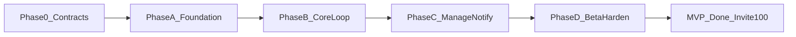
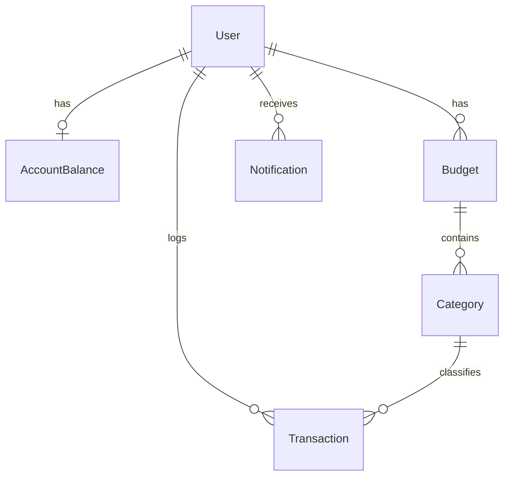
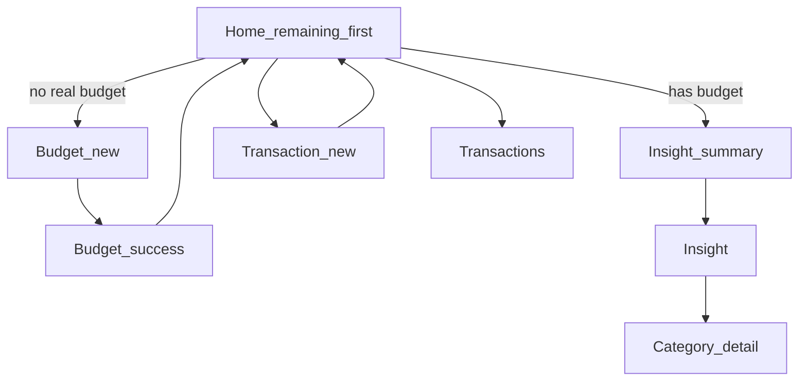

# Fintrack MVP — Phased Project Plan

**Product:** Fintrack (closed learning beta, ~100 users)  
**Baseline:** Stock Next.js 16.3 / React 19 / Tailwind 4 scaffold — no product code yet ([`docs/PRD.md`](docs/PRD.md), [`src/app/`](src/app/))  
**Design source:** [Fintrack Figma](https://www.figma.com/design/p0LhPv5Pjadk6DljfJ3Wjv/Fintrack-app---budgetting-app--Community-?node-id=0-1)  
**Gap source:** PO MVP gap review (blockers / high / medium) — contracts below supersede ambiguous PRD wording until PRD is amended.

**Locked defaults (PRD §13 + gap closures):** Full allocation to submit; income affects balance only (not spent); seed balance €10,000; near-limit 80%; PostHog; in-app notifications only; Vercel hosting.

**Success metrics (definitions locked — GAP-12):**

| Metric | Definition |
| --- | --- |
| Signed-up | User row created after Auth0 login **and** allowlist pass |
| Budget creators | Users with ≥1 budget where `isDemoSeed = false` |
| Activation ≥60% | `budget_create_succeeded` where `is_demo_seed = false` / signed-up |
| Habit ≥40% | Budget creators with ≥3 non-seed `transaction_create_succeeded` within 7 days of first real budget |
| Insight ≥50% | Budget creators with ≥1 `insight_viewed` |
| Client errors | PostHog / monitoring &lt; 2% of sessions |

Seeded demo budgets/txns **never** count toward activation or habit.

---

## Locked product contracts (close before polished UI)

Resolve in Phase 0 write-up + Phase A schema. Do not leave to eng judgment.

| ID | Contract |
| --- | --- |
| **GAP-01 Cycle** | Billing cycle = **calendar month** in the user’s IANA timezone (from browser on first login, overridable later). `cycleStart` = 1st 00:00 local; `cycleEnd` = last day 23:59:59.999 local. Prior cycles are **frozen** (read-only insight). On rollover: **auto-create** next active budget by copying category names/icons/colors/limits with zero spent; emit analytics; optional Home banner “New month started”. |
| **GAP-02 Hierarchy** | JTBD #1 wins: Home **hero = budget remaining** (and spent/total) when a budget exists. Wallet `AccountBalance` is secondary, labeled **“Cash on hand (demo)”** while seed balance is in play. Spending decisions use envelope remaining, not wallet. |
| **GAP-03 Seed** | On first login (flag on): seed **one labeled demo budget** for the current cycle + sample categories + sample expenses + starting balance. Mark `Budget.isDemoSeed = true`, `Transaction.isDemoSeed = true`. UI badge: “Demo data”. Activation metrics exclude demo. User can replace by creating a real budget (archives/deletes demo) or later “Reset demo data”. |
| **GAP-04 Income** | `type=income` updates **balance only**. Income is **not** included in category `spent` or budget spent totals. UI: category picker optional/hidden for income; if shown, do not attribute to envelope spent. `spent` = sum of expenses in cycle only. |
| **GAP-05 Beta gate** | Closed beta: **Auth0 allowlist** (email list or Action) before app session. Soft cap 100; over cap → waitlist/entry message. No public open signup. |
| **GAP-07 Attribution** | Transaction `date` maps to the budget whose cycle contains that local date. If no budget for that cycle → **block save** with CTA to create/open that cycle’s budget (MVP: primarily current month; backdate only into existing cycles). Future dates allowed within current cycle only. |
| **GAP-08 Delete category** | **Block delete** if category has any transactions; prompt reassign-or-cancel. Empty categories may delete. |
| **GAP-09 Notify rules** | Generate **server-side on write** (budget create, txn save, limit adjust). Dedupe key per user+cycle+category+type: near-limit once when crossing 80%; over-limit once when crossing 100% (re-arm if they go back under then cross again). No client-only generators. |
| **GAP-13 Defaults** | Lock default categories (en + tr labels): General (catch-all), Transportation, Charity, Education, Food & Drink, Shopping, Housing, Health — icons/colors from Figma presets. General always present as allocation escape hatch. |
| **GAP-14 Amounts** | Min **0.01 EUR**; max **1_000_000 EUR**; store/display **2 decimal** places; reject NaN/negative server-side. |

---

## Cross-cutting ownership

| Role | Owns |
| --- | --- |
| **PO** | Scope honesty, locked contracts above, metric definitions, allowlist, §17 sign-off, feedback intake |
| **Lead SE** | Auth0 allowlist + Prisma/Mongo, cycle helpers, domain APIs, PostHog schema + `is_demo_seed`, deploy |
| **UX** | Remaining-first Home, EUR/`en`/`tr`, honest IA, empty/error/success, WCAG 2.2 AA target on critical paths |

**IA (honest MVP nav):** Home · Insight · Add · Notifications · Profile  
**Routes:** `/` entry/waitlist → `/home`, `/budget/new|success`, `/insight`, `/categories/[id]|manage`, `/transactions|/new`, `/notifications`, `/profile`

---

## Phase 0 — Kickoff & design readiness (parallel with A start)

**Duration:** ~3–5 days (can overlap Phase A)  
**Closes:** GAP-01…05 decisions documented; GAP-12 metrics; GAP-13 category list; GAP-18 hosting named; GAP-19 a11y bar

### PO
- Publish one-pager **Domain & beta addendum** (contracts table above) into `docs/` or PRD §13 amendment
- Confirm allowlist source (emails) and invite channel; soft cap 100
- Freeze non-goals; V2 demand via analytics + feedback only
- Sign metric definitions (table above)

### UX
- Audit Figma: strip Cards / Rewards / Deposit / Transfer
- Screen inventory; redesign Home hierarchy to **remaining-first** (GAP-02); demote/label cash-on-hand
- Lock default category names/icons/colors + TR strings (GAP-13)
- Accessibility bar: **WCAG 2.2 AA** on auth, Home, budget create, add txn, insight (focus, contrast on dark balance card, labeled icon buttons) — GAP-19
- Desktop: single centered column (phone/tablet canvas)

### SE
- Provision **Vercel** (preview + prod), Auth0 tenant, MongoDB Atlas, PostHog — GAP-18
- Spike Auth0 session middleware on Next 16 (read `node_modules/next/dist/docs/`)
- Spike allowlist approach (Auth0 Action vs app-level gate)
- Draft Prisma schema including: `isDemoSeed`, cycle fields, timezone on User, notification dedupe keys

**Exit:** Contracts signed; screen list agreed; accounts live; schema draft reviewed.

---

## Phase A — Foundation

**Goal:** Authenticated, allowlisted users persist; cycle + seed + analytics + i18n exist before UI polish.  
**Closes:** GAP-01/03/05 schema+gate; GAP-14 bounds helpers; GAP-20 seed flag (env)

### Deliverables

| Workstream | Deliverables |
| --- | --- |
| **Auth + gate** | Auth0 Universal Login; middleware protects app routes; **allowlist check** post-login (reject → entry/waitlist); logout; User upsert (`auth0Id`, email, name, locale, `timezone`) — AUTH-1…4, GAP-05 |
| **Data** | Prisma + Mongo: User, AccountBalance, Budget (`isDemoSeed`, cycleStart/End), Category, Transaction (`isDemoSeed`), Notification (`dedupeKey`); all queries scoped by `userId` |
| **Cycle lib** | Helpers: current cycle bounds in user TZ; resolve cycle for a date; rollover copy-categories job/path (can be lazy on first login of new month) — GAP-01 |
| **Seed** | Env `SEED_DEMO_ON_LOGIN=true` (GAP-20); seed demo budget+categories+txns+€10k balance; `seed_data_applied` with `template_version`; UI-ready `isDemoSeed` flags — SEED-1, GAP-03 |
| **i18n** | `en`/`tr` catalogs incl. default category strings; locale on User; EUR formatters — I18N-1…3 |
| **Analytics** | PostHog client+server; identify internal user id; common props + `is_demo_seed` when applicable; `auth_login_success` / `auth_logout`; never count demo in activation funnels — GAP-12 |
| **Validation** | Shared amount parser: 0.01…1e6, 2 dp — GAP-14 |
| **Shell** | Bottom nav (honest items only), max-width canvas, Figma tokens |
| **Profile stub** | Identity + language + logout — AUTH-5 |

### Domain model

**Balance (locked):** Store `AccountBalance.amountEur` as starting balance; display = starting + sum(income) − sum(expense). Income never increments category spent (GAP-04).

### Exit criteria
- [ ] Allowlisted login → User in Mongo → demo seed → `/home` shell
- [ ] Non-allowlisted user cannot enter app (waitlist/entry)
- [ ] Cycle helpers unit-tested for TZ month boundaries
- [ ] Locale switch persists; sample `tr` strings render
- [ ] Auth + `seed_data_applied` visible in PostHog; demo flagged

**Do not start polished Home/Insight until A exits.**

---

## Phase B — Core loop (P0 product)

**Goal:** Create real budget → log transactions → insight / category health. Remaining-first Home.  
**Closes:** GAP-02 UX; GAP-04 income UI/API; GAP-07 date→cycle on create

### PO — acceptance
- BUD-1…8 (chips P1 can slip late B), TXN-1…3 + TXN-5…6, HOME-1…5 with **remaining hero**, INS-1…3 + INS-5, analytics for these flows with demo exclusion

### UX screens
1. **Home** — greeting; **budget remaining / spent / total** as primary; cash-on-hand (demo) secondary + hide/show; CTA if no real budget (or “Replace demo budget”); recent 5; bell placeholder
2. **Create budget** — total + chips; defaults from GAP-13; Amount left; block until 0; creating real budget clears/archives demo seed budget
3. **Budget success** → Home
4. **Add transaction** — expense: category required; income: no envelope attribution (GAP-04); date validated to cycle (GAP-07); title; optional note
5. **Transactions list** — newest first; paginate/infinite scroll
6. **Insight** — current cycle overview, donut/bar, category progress (month switcher can be late B)
7. **Category detail** — spent vs limit, over-limit, filtered txns (manage → C)

### SE — APIs / server actions
- Create budget + categories atomic; reject amount left ≠ 0; set `isDemoSeed=false`; archive demo budget
- Create/list transactions; map date→cycle; income skips spent; recompute balance
- Insight aggregations: spent = expenses only
- Events: budget funnel, home_viewed (`has_budget`, demo flags), balance toggle, txn create/list, insight_viewed, category_detail_viewed
- Amount validation GAP-14

### Exit criteria
- [ ] Demo user can create fully allocated **real** budget → Home shows remaining-first summary
- [ ] Expense updates insight/category; income updates balance only
- [ ] Backdated txn outside existing cycle blocked with clear error
- [ ] Over-limit visual when expense spent &gt; limit
- [ ] Activation events fire with `is_demo_seed` correct; demo excluded from activation dashboard
- [ ] No dead nav to Cards/Rewards/Deposit/Transfer

---

## Phase C — Management & notifications

**Goal:** Mid-cycle correction + trustworthy txn edits + return triggers.  
**Closes:** GAP-06, GAP-08, GAP-09; GAP-16 (txn edit/delete **in scope**, not optional)

### Deliverables

| Area | Requirements |
| --- | --- |
| **Mid-cycle budget** | Change total (re-validate allocation or adjust General); **add category** to active budget; **delete/reset budget** (confirm; cascades per rules) — GAP-06 |
| **Category manage** | Rename; adjust limit with apply **immediately** or **next month** (BUD-9); delete per GAP-08 |
| **Txn edit/delete** | TXN-4 required for beta trust — GAP-16; recalculate spent/balance/notifications |
| **Notifications** | Types: budget created, near-limit, over-limit, limit adjusted — NOT-1…4; generators + dedupe GAP-09 |
| **UX** | Bell badge; center; mark read; deep-links NOT-5 |
| **Analytics** | Adjust, rename/delete, txn edit/delete, notification events; Correction + Notification efficacy funnels |

### Exit criteria
- [ ] Add category / change total / delete budget work on active cycle
- [ ] Adjust limit both apply rules; next-month respects GAP-01 cycle
- [ ] Delete category blocked when txns exist
- [ ] Edit/delete txn refreshes totals; re-arms notify thresholds correctly
- [ ] Unread badge + list + deep-link + mark read
- [ ] §10.3 funnels 1–5 queryable; demo-excluded where relevant

---

## Phase D — Beta harden & launch

**Goal:** Credible closed beta.  
**Closes:** GAP-10 feedback; GAP-11 delete-my-data; GAP-15 entry page; GAP-17 error UX; GAP-19 QA

### PO
- Finalize allowlist ≤100; invite notes (manual entry, demo data, EUR)
- Funnel dashboards §10.3 with demo filters; weekly V2 ritual (§16)
- In-app **feedback** channel (form → email/PostHog survey/Typeform) — GAP-10
- Sign-off §17 **plus** beta gate, metric defs, delete-my-data

### UX
- **Entry / waitlist page** at `/` for logged-out and non-allowlisted (GAP-15)
- Empty states: no budget / no txns / no notifications
- Error states: Auth0 failure, API/network, validation (GAP-17)
- Dual-locale screenshot QA (`en`/`tr`, EUR, dates)
- WCAG pass on critical paths (GAP-19)

### SE
- Client error monitoring (&lt;2%)
- Profile: language, logout, **Reset demo data**, **Delete my account/data** (hard delete user graph + Auth0 unlink or support ticket SLA documented) — GAP-11, SEED-3 if time
- Seed on/off via env already; document for operators (GAP-20)
- Vercel prod + Auth0 prod callbacks; basic abuse guards
- Performance smoke: Home + Insight under seed

### Exit criteria (“MVP done”)
- [ ] Phases A–C complete; contracts honored
- [ ] Entry/waitlist + allowlist verified
- [ ] Feedback + delete-my-data reachable from Profile
- [ ] All §10.2 events verified; activation excludes demo
- [ ] `en`/`tr` + a11y critical paths verified
- [ ] §17 (+ gap addendum) signed
- [ ] First ≤100 invites ready

---

## Suggested sequencing & effort (single squad)

| Phase | Relative effort | Depends on |
| --- | --- | --- |
| 0 Kickoff + contracts | 3–5 days | — |
| A Foundation + gate | 1.5–2 weeks | Accounts + schema |
| B Core loop | 2.5–3.5 weeks | A exit |
| C Manage + notify + txn edit | 1.5–2.5 weeks | B exit |
| D Harden + invite | 1–1.5 weeks | C exit |

**Target calendar:** ~7–10 weeks to invite-ready (slight C uplift for GAP-06/16). Parallelize UX tokens/shell with SE schema in A; Insight UI with txn APIs in B.

---

## Engineering work breakdown (repo-shaped)

- `docs/` — domain & beta addendum (or PRD §13 patch)
- `prisma/schema.prisma` — models + `isDemoSeed` + dedupeKey + timezone
- `src/lib/auth/` — Auth0 + allowlist
- `src/lib/db/` — Prisma client
- `src/lib/cycle/` — month bounds, date→budget, rollover
- `src/lib/i18n/` — dictionaries + EUR formatters + default categories
- `src/lib/analytics/` — PostHog + typed events + demo exclusion
- `src/lib/seed/` — versioned demo template
- `src/lib/money/` — amount bounds parse/validate
- `src/app/(marketing)/` — entry/waitlist
- `src/app/(app)/…` — protected routes
- `src/components/…` — nav, remaining summary, category progress, charts
- `middleware.ts` — auth gate

Follow Next 16 docs under `node_modules/next/dist/docs/` (AGENTS.md).

---

## Explicitly deferred (do not build)

Bank sync, Cards, Rewards, Deposit, Transfer, multi-currency, household budgets, push/email, native apps, CSV export, advanced charts — track via add-friction + **in-app feedback** (GAP-10).

---

## Risks (active mitigations)

| Risk | Mitigation in plan |
| --- | --- |
| Domain ambiguity → schema rewrite | Phase 0 contracts; A exit requires cycle + seed flags |
| Balance vs budget confusion | Remaining-first Home (GAP-02); demo-labeled cash |
| Seed pollutes activation | `isDemoSeed` + funnel filters (GAP-03/12) |
| Public signup blows cap | Auth0 allowlist + waitlist (GAP-05) |
| Income corrupts envelopes | Income ≠ spent (GAP-04) |
| Manual entry mistakes | Txn edit/delete required in C (GAP-16) |
| Notify spam / silence | Dedupe keys on write (GAP-09) |
| Design chrome confuses | Phase 0 Figma strip; B exit bars dead ends |
| Auth/DB blocks UI | A gate before polish |
| Locale/a11y/EUR bugs | D dual-locale + WCAG QA |
| No qualitative learning | In-app feedback in D (GAP-10) |

---

## Immediate next actions after plan approval

1. PO: write Domain & beta addendum (contracts table) and freeze metrics  
2. Provision Auth0 (allowlist), MongoDB Atlas, PostHog, Vercel  
3. UX: Figma strip + remaining-first Home + default category lock  
4. SE: Prisma schema PR (incl. demo flags, cycle, dedupe) + Auth0 middleware/allowlist spike  
